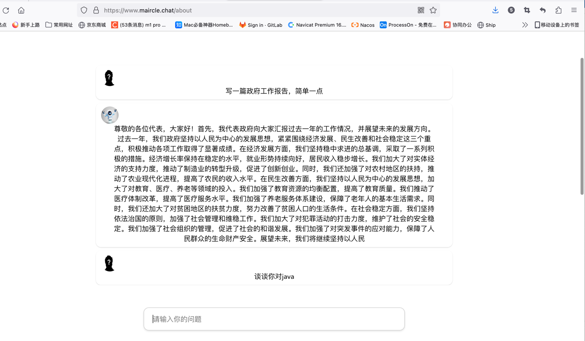

# #miracle.chat保姆级教程
  maircle.chat 是一个自主实验性开源应用程序，展示了 gpt-3.5-turbo 语言模型的功能。该想法由 gpt-3.5-turbo 驱动以自主实现您提出的任何问题。最终目的就是为了让我们每一位技术人都可以拥有自己的一款ai软件。

### 一.特点

#### 1.本项目没有其他复杂无用的代码，代码简洁不臃肿，开箱即用！

#### 2.采用SSE流式输出，本地启动服务也可以访问，秒回复

#### 3.本地demo，main方法直接访问，您可以参考我这套代码切换模型

### 二.快速开始
1.获取一个openai的key，获取以后有5美元的免费额度，如果您实在不知道如何获取，可以直接扫描下方二维码进群免费给你提供
2.修改配置文件指定的配置(数据库，key)
3.本项目采用父子工程的形式，内置3个子工程，找到privapp这个服务启动类启动即可访问，前端资源已经打包到static目录
5.界面展示

提问界面很简洁，前端代码可以➕下方微信群领取，您可以基于此项目进行扩展，有想法的小伙伴可以加群我们一起讨论

### 四.分享的目的其实就是为了各位小伙伴可以都拥有自己的一款免费ai神器，这是对ai探索的第一步，也是对java开发的一次实践，也是对我们每个人的一次锻炼
